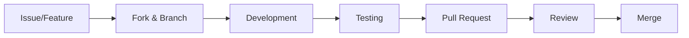

# Contribution Guidelines for UnauthScout

Thank you for your interest in contributing to UnauthScout! This document describes the project standards, development process, and how you can help.

---

## 🎯 Overview

UnauthScout follows specific design principles:
- **Unauthenticated by default** - No tokens, no credentials
- **Explicit contracts** - JSON schemas as source of truth
- **Provider-based architecture** - Extensible but consistent
- **CLI-first** - Command-line interface as priority

---

## 📋 Before You Start

### Prerequisites
- Bash (POSIX-compatible)
- `curl` and `jq` installed
- Basic Git (clone, branch, PR)
- Understanding of REST APIs

### Development Environment
```bash
# 1. Fork and clone
git clone https://github.com/YOUR_USERNAME/unauthscout.git
cd unauthscout

# 2. Test local installation
chmod +x bin/unauthscout
./bin/unauthscout --version

# 3. Run tests (if available)
./run-tests.sh
```

---

## 🏗 Project Architecture

```
unauthscout/
├── bin/
│   └── unauthscout          # CLI entry point
├── lib/
│   ├── github_api.sh        # GitHub API integration
│   ├── gitlab_api.sh        # GitLab API integration
│   └── common/              # Shared logic
├── schemas/                 # Data contracts (JSON Schema)
├── docs/                    # Technical documentation
└── tests/                   # Automated tests
```

### Design Principles
1. **Separation of concerns**: Each provider in its own file
2. **Schemas as contracts**: Integrated validation and documentation
3. **Fail fast**: Clear and specific errors
4. **Consistent output**: Normalized JSON across providers

---

## 🔧 Development Process

### 1. Workflow


### 2. Branch Naming Convention
```
feat/     - New functionality    Ex: feat/github-repos
fix/      - Bug fixes            Ex: fix/curl-timeout
docs/     - Documentation        Ex: docs/api-examples
refactor/ - Refactoring          Ex: refactor/output-formatting
```

### 3. Semantic Commits
```bash
# Format: type(scope): description

feat(github): add repository enumeration
fix(core): handle API rate limiting
docs(readme): update installation instructions
refactor(gitlab): simplify user parsing
test: add integration tests for providers
chore: update dependencies in bin/ script
```

**Valid types**: `feat`, `fix`, `docs`, `style`, `refactor`, `test`, `chore`

---

## 🧪 Code Standards

### Shell Script Guidelines
```bash
#!/usr/bin/env bash
# File name: snake_case.sh

# Variables: UPPERCASE with underscores
GITHUB_API_URL="https://api.github.com"
MAX_RETRIES=3

# Functions: snake_case with description
fetch_user_data() {
    local username="$1"  # Always declare local variables
    local timeout="${2:-10}"  # Default values
    
    # Early return validation
    [[ -z "$username" ]] && return 1
    
    # Main code
    curl -sf --max-time "$timeout" \
        "${GITHUB_API_URL}/users/${username}"
}

# Consistent error handling
die() {
    echo "Error: $1" >&2
    exit 1
}
```

### Specific Rules
1. **Shebang**: Always `#!/usr/bin/env bash`
2. **Strict mode**: `set -euo pipefail` in complex scripts
3. **Variables**: Declare before use, always quoted
4. **Functions**: Document with comment above function
5. **Exit codes**: 0 for success, 1+ for specific errors

---

## 📝 Documentation

### 1. Inline Comments
```bash
# GOOD: Explains the "why", not the "what"
# Cache for 60 seconds to avoid rate limiting
cache_ttl=60

# BAD: Obvious
# Set cache_ttl to 60
cache_ttl=60
```

### 2. README vs Wiki
- **README.md**: Overview, quick install, basic examples
- **Wiki**: Complete documentation, tutorials, API reference

### 3. Schemas as Documentation
```json
{
  "$schema": "http://json-schema.org/draft-07/schema#",
  "title": "GitHub User",
  "description": "Normalized GitHub user profile",
  "type": "object",
  "properties": {
    "id": {
      "type": "integer",
      "description": "GitHub's internal user ID"
    }
  }
}
```

---

## 🐛 Reporting Issues

### Bug Report Template
```markdown
## Bug Description
[Clear and concise description]

## Steps to Reproduce
1. Command executed: `unauthscout ...`
2. Observed error: [error message]
3. Expected behavior: [what should happen]

## Environment
- OS: [ex: Ubuntu 22.04]
- Bash version: `bash --version`
- curl version: `curl --version`
- jq version: `jq --version`

## Relevant Logs
[Command output with --verbose if applicable]
```

### Feature Request Template
```markdown
## Problem/Need
[What you're trying to solve]

## Proposed Solution
[Feature description]

## Alternatives Considered
[Other possible approaches]

## Expected Impact
[Who would benefit and how]
```

---

## 🔄 Pull Request Process

### 1. PR Checklist
- [ ] Code follows project standards
- [ ] Tests added/updated (if applicable)
- [ ] Documentation updated
- [ ] Schema updated (if changing output)
- [ ] Semantic and well-described commits

### 2. PR Template
```markdown
## Changes
[List of main changes]

## Change Type
- [ ] Bug fix
- [ ] New feature
- [ ] Breaking change
- [ ] Documentation

## Testing
[How you tested the changes]

## Screenshots/Output
[Relevant CLI output]

## Related Issues
Fixes #123
```

### 3. Review Guidelines
- **Reviewers**: Focus on logic, security, and consistency
- **Authors**: Address all review comments
- **Everyone**: Keep discussion technical and respectful

---

## 🏷 Versioning

### Semantic Versioning
```
MAJOR.MINOR.PATCH
1.0.0

MAJOR - Breaking changes in schemas or CLI
MINOR - New features without breaking changes
PATCH - Bug fixes and minor improvements
```

### Release Process
1. Issues grouped into milestones
2. Feature freeze before release
3. Tagging with semantic version
4. CHANGELOG.md updated

---

## 🛡 Security

### Reporting Security Issues
**DO NOT open public issues for vulnerabilities!**

Email: ws2git@gmail.com
Subject: "Security Vulnerability in UnauthScout"

Include:
- Detailed description
- Steps to reproduce
- Potential impact
- Fix suggestions

---

## ❓ Frequently Asked Questions

### "Where do I start contributing?"
1. Look for issues with `good-first-issue` label
2. Check `help-wanted` for accessible tasks
3. Improve existing documentation

### "Do I need to know all APIs?"
No! Focus on one provider at a time. Each has its own file.

### "How to test without spamming APIs?"
Use mocks or sample data. Avoid real API calls in loops.

---

## Support

- **Discussions**: For questions and ideas
- **Issues**: For bugs and feature requests
- **Wiki**: For complete documentation

---

## 🙏 Acknowledgments

Thank you for contributing to open source tools! Every PR, reported issue, or repository star helps the community.

---

*This document is living and evolves with the project. Improvement suggestions are welcome!*
```

## 📁 Related Files to Create:

```
.github/
├── ISSUE_TEMPLATE/
│   ├── bug_report.md
│   └── feature_request.md
└── PULL_REQUEST_TEMPLATE.md
```

## 🎯 Key Points of This CONTRIBUTING.md:

1. **UnauthScout-specific** - Not generic
2. **Includes technical standards** - Shell script guidelines
3. **Clear process** - From fork to merge
4. **Quality-focused** - Schemas, tests, documentation
5. **New contributor friendly** - Easy start

This document sets clear expectations while keeping the door open for community contributions! 🚀
