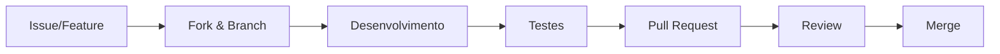

# Contribuindo para o UnauthScout

Obrigado pelo seu interesse em contribuir com o UnauthScout! Este documento descreve os padrões do projeto, processo de desenvolvimento e como você pode ajudar.

---

## 🎯 Visão Geral

UnauthScout segue princípios de design específicos:
- **Não autenticado por padrão** - Sem tokens, sem credenciais
- **Contratos explícitos** - Schemas JSON como fonte da verdade
- **Arquitetura baseada em providers** - Extensível, mas consistente
- **CLI-first** - Interface de linha de comando como prioridade

---

## 📋 Antes de Começar

### Pré-requisitos
- Bash (POSIX-compatible)
- `curl` e `jq` instalados
- Git básico (clone, branch, PR)
- Entendimento de APIs REST

### Ambiente de Desenvolvimento
```bash
# 1. Fork e clone
git clone https://github.com/SEU_USERNAME/unauthscout.git
cd unauthscout

# 2. Teste a instalação local
chmod +x bin/unauthscout
./bin/unauthscout --version

# 3. Execute os testes (se houver)
./run-tests.sh
```

---

## 🏗 Arquitetura do Projeto

```
unauthscout/
├── bin/
│   └── unauthscout          # Ponto de entrada CLI
├── lib/
│   ├── github_api.sh        # Integração com GitHub API
│   ├── gitlab_api.sh        # Integração com GitLab API
│   └── common/              # Lógica compartilhada
├── schemas/                 # Contratos de dados (JSON Schema)
├── docs/                    # Documentação técnica
└── tests/                   # Testes automatizados
```

### Princípios de Design
1. **Separação de responsabilidades**: Cada provider em seu próprio arquivo
2. **Schemas como contratos**: Validação e documentação integradas
3. **Fail fast**: Erros claros e específicos
4. **Output consistente**: JSON normalizado entre providers

---

## 🔧 Processo de Desenvolvimento

### 1. Fluxo de Trabalho


### 2. Branch Naming Convention
```
feature/  - Novas funcionalidades     Ex: feature/github-repos
fix/      - Correções de bugs         Ex: fix/curl-timeout
docs/     - Documentação              Ex: docs/api-examples
refactor/ - Refatoração               Ex: refactor/output-formatting
```

### 3. Commits Semânticos
```bash
# Formato: tipo(escopo): descrição

feat(github): add repository enumeration
fix(core): handle API rate limiting
docs(readme): update installation instructions
refactor(gitlab): simplify user parsing
test: add integration tests for providers
chore: update dependencies in bin/ script
```

**Tipos válidos**: `feat`, `fix`, `docs`, `style`, `refactor`, `test`, `chore`

---

## 🧪 Padrões de Código

### Shell Script Guidelines
```bash
#!/usr/bin/env bash
# Nome do arquivo: snake_case.sh

# Variáveis: UPPERCASE com underscores
GITHUB_API_URL="https://api.github.com"
MAX_RETRIES=3

# Funções: snake_case com descrição
fetch_user_data() {
    local username="$1"  # Sempre declarar variáveis locais
    local timeout="${2:-10}"  # Valores padrão
    
    # Validação early return
    [[ -z "$username" ]] && return 1
    
    # Código principal
    curl -sf --max-time "$timeout" \
        "${GITHUB_API_URL}/users/${username}"
}

# Tratamento de erros consistente
die() {
    echo "Error: $1" >&2
    exit 1
}
```

### Regras Específicas
1. **Shebang**: Sempre `#!/usr/bin/env bash`
2. **Modo estrito**: `set -euo pipefail` em scripts complexos
3. **Variáveis**: Declarar antes de usar, sempre entre aspas
4. **Funções**: Documentar com comentário acima da função
5. **Exit codes**: 0 para sucesso, 1+ para erros específicos

---

## 📝 Documentação

### 1. Inline Comments
```bash
# BOM: Explica o "porquê", não o "o quê"
# Cache por 60 segundos para evitar rate limiting
cache_ttl=60

# RUIM: Óbvio
# Define cache_ttl como 60
cache_ttl=60
```

### 2. README vs Wiki
- **README.md**: Visão geral, instalação rápida, exemplos básicos
- **Wiki**: Documentação completa, tutoriais, referência de API

### 3. Schemas como Documentação
```json
{
  "$schema": "http://json-schema.org/draft-07/schema#",
  "title": "GitHub User",
  "description": "Normalized GitHub user profile",
  "type": "object",
  "properties": {
    "id": {
      "type": "integer",
      "description": "GitHub's internal user ID"
    }
  }
}
```

---

## 🐛 Reportando Issues

### Template de Bug Report
```markdown
## Descrição do Bug
[Descrição clara e concisa]

## Passos para Reproduzir
1. Comando executado: `unauthscout ...`
2. Erro observado: [mensagem de erro]
3. Comportamento esperado: [o que deveria acontecer]

## Ambiente
- OS: [ex: Ubuntu 22.04]
- Bash version: `bash --version`
- curl version: `curl --version`
- jq version: `jq --version`

## Logs Relevantes
[Saída do comando com --verbose se aplicável]
```

### Template de Feature Request
```markdown
## Problema/Necessidade
[O que você está tentando resolver]

## Solução Proposta
[Descrição da funcionalidade]

## Alternativas Consideradas
[Outras abordagens possíveis]

## Impacto Esperado
[Quem se beneficiaria e como]
```

---

## 🔄 Pull Request Process

### 1. Checklist do PR
- [ ] Código segue padrões do projeto
- [ ] Testes adicionados/atualizados (se aplicável)
- [ ] Documentação atualizada
- [ ] Schema atualizado (se mudar output)
- [ ] Commits semânticos e bem descritos

### 2. Template do PR
```markdown
## Mudanças
[Lista das principais alterações]

## Tipo de Mudança
- [ ] Bug fix
- [ ] Nova feature
- [ ] Breaking change
- [ ] Documentação

## Testes
[Como você testou as mudanças]

## Screenshots/Output
[Saída relevante do CLI]

## Issues Relacionadas
Fixes #123
```

### 3. Review Guidelines
- **Reviewers**: Focar em lógica, segurança e consistência
- **Authors**: Responder a todos os comentários do review
- **Todos**: Manter discussão técnica e respeitosa

---

## 🏷 Versionamento

### Semantic Versioning
```
MAJOR.MINOR.PATCH
1.0.0

MAJOR - Breaking changes em schemas ou CLI
MINOR - Novas features sem breaking changes
PATCH - Bug fixes e melhorias menores
```

### Processo de Release
1. Issues agrupadas em milestones
2. Feature freeze antes do release
3. Tagging com versão semântica
4. CHANGELOG.md atualizado

---

## 🛡 Segurança

### Reporting Security Issues
**NÃO abra issues públicas para vulnerabilidades!**

Email: [seu-email@domain.com]  
Assunto: "Security Vulnerability in UnauthScout"

Inclua:
- Descrição detalhada
- Passos para reproduzir
- Impacto potencial
- Sugestões de correção

---

## ❓ Dúvidas Frequentes

### "Onde começo a contribuir?"
1. Veja issues com label `good-first-issue`
2. Check `help-wanted` para tarefas acessíveis
3. Melhore documentação existente

### "Preciso conhecer todas as APIs?"
Não! Foque em um provider por vez. Cada um tem seu arquivo.

### "Como testar sem fazer spam nas APIs?"
Use mocks ou dados de exemplo. Evite chamadas reais em loops.

---

## 📞 Suporte

- **Discussions**: Para dúvidas e ideias
- **Issues**: Para bugs e feature requests
- **Wiki**: Para documentação completa

---

## 🙏 Agradecimentos

Obrigado por contribuir para ferramentas de código aberto! Cada PR, issue reportada ou estrela no repositório ajuda a comunidade.

---

*Este documento é vivo e evolui com o projeto. Sugestões de melhoria são bem-vindas!*
```

## 📁 Arquivos Relacionados a Criar:

```
.github/
├── ISSUE_TEMPLATE/
│   ├── bug_report.md
│   └── feature_request.md
├── PULL_REQUEST_TEMPLATE.md
└── CODE_OF_CONDUCT.md
```

## 🎯 Pontos Chave Deste CONTRIBUTING.md:

1. **Específico para UnauthScout** - Não genérico
2. **Inclui padrões técnicos** - Shell script guidelines
3. **Processo claro** - Do fork ao merge
4. **Focado em qualidade** - Schemas, testes, documentação
5. **Amigável para novos contribuidores** - Começo fácil

Este documento estabelece expectativas claras enquanto mantém a porta aberta para contribuições da comunidade! 🚀
